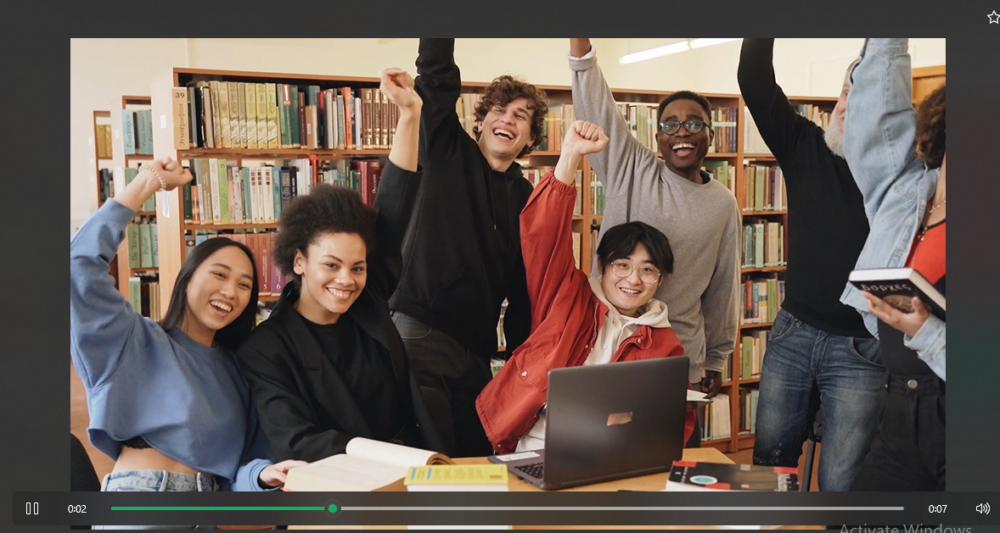

# QuizQuest-2-033-048-103-C
🧠 QuizQuest-2

QuizQuest-2 is an interactive quiz application designed to help students prepare topic-wise across different subjects. Built using React (Vite) with JavaScript, HTML, and CSS, the platform offers a smooth and responsive user experience.

🎯 Project Overview

QuizQuest-2 aims to make learning more engaging by allowing users to attempt quizzes topic by topic. Each quiz is designed to enhance conceptual understanding and self-assessment.

⚙ Key Features

📚 Subject-Wise Topics: Students can select a subject and attempt quizzes based on specific topics.

⚡ Real-Time Evaluation: Instant feedback and scoring as users progress through questions.

💬 Answer Descriptions: After each question, a short explanation helps clarify the correct answer.

🔄 Dynamic Question Flow: Questions are presented in a smooth, responsive flow for better engagement.

🎨 Modern UI/UX: Built with React and CSS to ensure a clean, user-friendly interface.

🌐 Web-Based Accessibility: Easily accessible on multiple devices through any modern browser.

💻 Tech Stack

Frontend Framework: React (Vite)

Languages Used: JavaScript, HTML, CSS

Version Control: Git & GitHub

🚀 Future Enhancements

🧾 User login and progress tracking

📊 Leaderboard and performance analytics

🧩 Timed quizzes and difficulty levels

🌈 Custom quiz creation by teachers or admins

👥 Contributors

This project is developed collaboratively by our group as part of our coursework/project initiative to explore frontend development and improve learning through technology.

## 🎥 Project Demo

> Click the image above to watch the full demo video.

